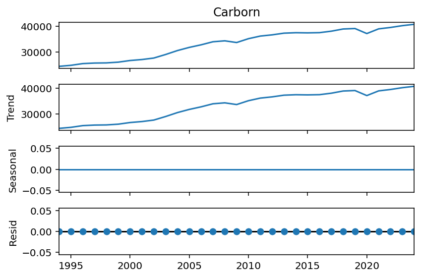
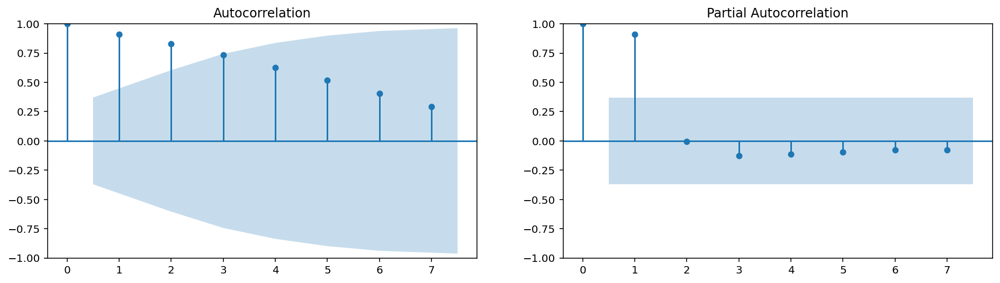
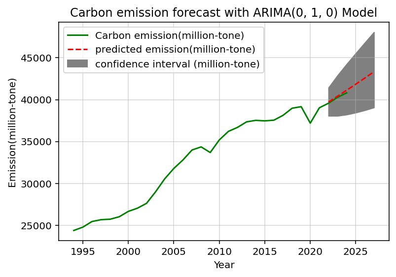
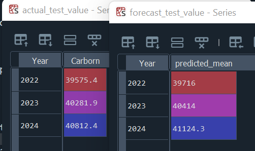
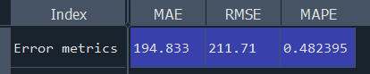

# 🌍 Carbon Emission Forecasting Using ARIMA (0,1,0) Model

> *Predicting global CO₂ emissions for a sustainable future*

This project applies the ARIMA (Autoregressive Integrated Moving Average) model to historical carbon emission data to forecast future trends and quantify prediction accuracy. The final model is used to project emissions over a 6-year timeframe, providing crucial insights for environmental planning and policy-making.

## Dataset

**Source:** [Energy Institute](https://www.energyinst.org)
- **Description:** Energy Institute Statistical Review of World Energy
- **File name:** `EI-Stats-Review-ALL-data.xlsx


> *The dataset contains aggregated emissions data representing worldwide energy-related CO₂ output.*
 
## Model Overview

The modeling was carried out using Spyder (Python) within the Anaconda environment.
The process involved the following key stages:

## 1. Data Cleaning & Transformation

- Removal of missing values and irrelevant columns.

- Converting emission data to a proper time series format.

## 2. Exploratory Data Analysis (EDA)

- Line plots and decomposition to understand trend and seasonality.

- ACF and PACF plots to evaluate autocorrelation patterns.

## 3. Model Building

- Applied ARIMA (0,1,0) model.

- Parameters chosen based on stationarity and AIC/BIC evaluation.

## 4. Model Evaluation

Metrics used:

- MAE – Mean Absolute Error

- RMSE – Root Mean Squared Error

- MAPE – Mean Absolute Percentage Error


## Data Preparation: 

```

import pandas as pd
import statsmodels as sm
import numpy as np
import statsmodels.api as sm
import matplotlib.pyplot as plt
from statsmodels.tsa.seasonal import seasonal_decompose
from statsmodels.tsa.stattools import adfuller 
from statsmodels.graphics.tsaplots import plot_acf, plot_pacf
from statsmodels.tsa.arima.model import ARIMA
import warnings
warnings.filterwarnings("ignore")
from sklearn.metrics import mean_absolute_error, mean_squared_error


file = 'EI-Stats-Review-ALL-data.xlsx'

Enfile = pd.ExcelFile(file)
print(Enfile.sheet_names)


def extract_data(sheet, Country, column_name):
    df = pd.read_excel(Enfile, sheet_name=sheet, skiprows=2)
    df.rename(columns={df.columns[0]: "Country"}, inplace=True)
    df = df.groupby("Country").sum(numeric_only=True).reset_index()
    df = df.set_index("Country")
    df.replace({"_":0}, inplace=True)
    df = df[df.columns[:-3]]
    df = pd.DataFrame(df.loc[Country])
    df.rename(columns={Country: column_name}, inplace=True)
    df = df.map(lambda x: x.strip() if isinstance(x, str) else x)
    
    return df

Carborn_df = extract_data("CO2e Emissions ", "Total World", "Carborn")

#CHOOSING MY SAMPLE SIZE (FROM 1994 TO 2024)
Carborn_df = Carborn_df.reset_index()
Carborn_df.rename(columns={Carborn_df.columns[0]: "Year"}, inplace= True)
Carborn_df = Carborn_df.query("Year >=1994  and Year <= 2024")
Carborn_df = Carborn_df[["Year", "Carborn"]].set_index("Year")


```

## Model Fitting (Why ARIMA?)

---
    Carborn_df.plot()
    
    #Since there is no serious seasonal pattern additive method of seasonal decomposition will be used
    
    Carborn_decom = seasonal_decompose(Carborn_df['Carborn'], model='additive',period=1)
    Carborn_decom.plot()

---

- Decomposition Chart


From the decomposition chart, it shows a clear trend overtime, the yearly frequency does not account for seasonality is constant over time and also the residual appears to be close to white noise. 
> **Therefore ARIMA may be a good fit for the analysis**


## Stationarity Testing:

## before differencing

---
    # conversion to logarithm
     CO2_series = Carborn_df.squeeze()
      
     if CO2_series.min() <= 0:
     CO2_series += abs(CO2_series.min()) +1
          
     print("WARNING: Data shifted to positivity to ensure log transformation")
      
     CO2_log = np.log(CO2_series)
     
     result = adfuller(CO2_log)
     
     
     print('ADF %f:' %result[0],
            'P-value %f:' %result[1])
 
---
  
|ADF | P-value |
|-----|--------|
|-1.428161 | 0.568704|

The result from ADF test failed to reject the the null hypothesis that the data is stationary. Thus, the  need for differencing (d) to de-trend

## After differencing
---

     result_d1 = adfuller(CO2_log.diff().dropna())
          
     print('ADF %f:' %result_d1[0])
     print('P-value %f:' %result_d1[1])

---

| ADF | P-value|
|------|----|
|-4.753784 |  0.000067|

The Augmented Dickey-Fuller (ADF) test confirmed that the log-transformed series required first-order differencing to achieve stationarity.

Model Selection: Based on low AIC/BIC scores and residual analysis, the optimal model was determined to be ARIMA(0,1,0) with drift (trend='t').


d=1 (Integrated component/First difference)

Hence: Yt′​=Yt ​− Yt−1

## The Code 
---
     
      result = adfuller(CO2_log)
      
      
      print('ADF %f:' %result[0],
             'P-value %f:' %result[1])
             
      # splitting data for Testing and Training
      log_train = CO2_log[:-3]
      log_test = CO2_log[-3:]

      #Ploting to check for autocorrelation and partial autocorrelation
      fig, axes = plt.subplots(1, 2, figsize=(16,4))
      plot_acf(log_train, ax=axes[0], lags= 7)
      plot_pacf(log_train, ax=axes[1], lags= 7)
      plt.show()

---

## ACF & PACF Plots


There no significant Autocorrelation and partial Autocorrelation observed after d=1, thus;
p=0 (No Autoregressive component)

q=0 (No Moving Average component)

To avoid overfitting, ARIMA(0, 1, 0) will be used in this analysis


## Training/Testing: 

I splited the data for training and testing, 27 data points for trainoing and the last 3 data points was reserved for testing the accuracy of my model's prediction as shown in the code blocks above


## Forecasting: 

The model was trained on the full historical dataset and was used to forecast emission levels and their confidence intervals(95%).

---
    forecast_steps = 6
    
    log_train_forecast = ARIMA(log_train, order=(0, 1, 0), trend='t').fit()
    
    log_final_forecast = log_train_forecast.get_forecast(steps=forecast_steps)
    
    final_forecast = np.exp(log_final_forecast.predicted_mean)
    confidence_interval_forecast = np.exp(log_final_forecast.conf_int(alpha=0.05))

---

## 📊 Key Results

### forcast Result
The prediction for test (2021 - 2024) and for  2025 - 2027

### Prediction


## The PLot 
The plot of Carbon emission trend from 1984 - 2024 (green), predicted emissions from 2021 - 2027 (red)
shows how close the predictions are to the actual values of the test period

---
      plt.plot(CO2_series.index, CO2_series.values, label="Carbon emission(million-tone)", color="green")
      
      plt.plot(PREDICTION.index, PREDICTION['Predicted emission'], label="predicted emission(million-tone)", color="red", linestyle='--')
       
      plt.fill_between(PREDICTION.index, PREDICTION["Lower_ci (95%)"], PREDICTION['Upper_ci (95%)'], label="confidence interval (million-tone)", color="grey")
      
      plt.title(f'Carbon emission forecast with ARIMA(0, 1, 0) Model')
      plt.ylabel('Emission(million-tone)')
      plt.xlabel('Year')
      plt.grid(True, alpha= 0.5)
      plt.legend()
      plt.show()
---
## Forecast plot


## Evaluation Metrics (Mean Error Metrics)
The Mean Absolute Error (MAE), Root Mean Square and the Mean Absolute Percnetage were calculated to measure how far off are the predicted values to the actual values.

---
     test_forecast_steps = 3
     forecast_log_test = log_train_forecast.get_forecast(steps=test_forecast_steps)
     
     forecast_test_value = np.exp(forecast_log_test.predicted_mean)
     
     actual_test_value = np.exp(log_test)
     
     
     
     
     MAE_CO2 = mean_absolute_error(actual_test_value, forecast_test_value)
     
     RMSE_CO2 = np.sqrt(mean_squared_error(actual_test_value, forecast_test_value))
     
     #MEAN ABSOLUTE PERCENTAGE ERROR
     forecast_test_value.index = actual_test_value.index
     
     MAPE_CO2 = np.mean(np.abs((actual_test_value - forecast_test_value)/actual_test_value)) * 100
     
     
     Mean_errors_Metrics = pd.DataFrame({
         'MAE': [MAE_CO2],
         'RMSE': [RMSE_CO2],
         'MAPE': [MAPE_CO2]
         },index=['Error metrics'])
---


## Test forecast values VS test actual values


Mean Result shows that the predicted values did not really deviate from it's actual values, which means forecast are reliable 



---

## 🧠 Key Insights/Discussion

- The forecast reveals a steady upward trend in carbon emissions, indicating continuous dependency on fossil fuels.

- While growth appears moderate, even small increases can significantly impact global warming and climate systems.

- A 0.48% MAPE confirms the ARIMA model provides high predictive accuracy for short-term forecasts.

However, the model does not account for policy changes, technological innovation, or renewable adoption — which may alter future emission patterns.


## 🛠️ Tools and Libraries

| Library | Purpose |
|----------|----------|
| `pandas` | Data manipulation and cleaning |
| `numpy` | Numerical computations |
| `matplotlib` | Visualization |
| `statsmodels` | ARIMA model implementation |


[^1]: 📬 Author

👤 Lukman Akorede
>Data Analyst, Data Science & Machine Learning Enthusiast

---

